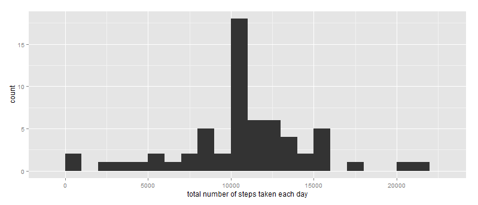

# Reproducible Research: Peer Assessment 1

---


## Loading and preprocessing the data

Read in the data.
```{r}
unzip(zipfile="repdata_data_activity.zip")
data <- read.csv("activity.csv")
```


## What is mean total number of steps taken per day?

First, calculate the mean number of steps for each day:

```r
data.sum = aggregate(x=list(steps=data$steps),by=list(Date=data$date),FUN=sum,na.rm=T)
```


Let's look at the mean and median for the total steps per day:

```r
mean(data.sum$steps, na.rm=TRUE)
```

[1] 9354

```r
median(data.sum$steps, na.rm=TRUE)
```

[1] 10395


And let's take a look at the distribution of total number of steps per day with a histogram:

```r
library(ggplot2)
qplot(total.steps, xlab = "Total steps", ylab = "Frequency")
```

```
## stat_bin: binwidth defaulted to range/30. Use 'binwidth = x' to adjust this.
```

 


## What is the average daily activity pattern?

Calculate the mean steps for each five minute interval.

```r
averages <- aggregate(x=list(steps=data$steps), by=list(interval=data$interval),
                      FUN=mean, na.rm=TRUE)
```


Let's take a look at a time series plot for the mean steps.

```r
ggplot(data=averages, aes(x=interval, y=steps,ymax=max(averages$steps))) +
        geom_line(colour="coral1", size=1.0) +
        xlab("5-minute interval") +
        ylab("average number of steps taken")
```

 


Which five minute interval has the highest mean number of steps?

```r
averages[which.max(averages$steps),]
```

[1]     interval     day    steps
104      835 weekday 230.3782


## Imputing missing values
Identify the number of intervals with missing step counts ("NA's"):
```{r}
all.na <- sum(is.na(data$steps))
```


Replacing each missing value with the mean value of its 5-minute interval
```{r}
fill.value <- function(steps, interval) {
        filled <- NA
        if (!is.na(steps))
                filled <- c(steps)
        else
                filled <- (averages[averages$interval==interval, "steps"])
        return(filled)
}

```


Comparing the mean and median steps for each day between the original data set with NAvalues and the imputed data set.
```{r}
total.steps <- tapply(filled.data$steps, filled.data$date, FUN=sum)
#mean and median total number of steps taken per day 
mean_noNA <- mean(total.steps)
median_noNA <- median(total.steps)
mean_withNA <- mean(data.sum$steps, na.rm=TRUE)
median_withNA <- median(data.sum$steps, na.rm=TRUE)

```


And a histogram of the imputed dataset.

```r
qplot(total.steps, binwidth=1000, xlab="total number of steps taken each day")
```


 


Imputing the missing data has increased the average number of steps. 

## Are there differences in activity patterns between weekdays and weekends?


```{r}
Day <- function(date) {
        day <- weekdays(date)
        if (day %in% c("Monday", "Tuesday", "Wednesday", "Thursday", "Friday"))
                return("weekday")
        else if (day %in% c("Saturday", "Sunday"))
                return("weekend")
        else
                stop("invalid date")
}
filled.data$date <- as.Date(filled.data$date)
filled.data$day <- sapply(filled.data$date, FUN=Day)
```


Now let's compare the patterns between weekdays and weekends.

```{r timeseries_daytype}
ggplot(averages, aes(interval, steps)) + facet_grid(day ~ .) +
        geom_line(colour="coral1", size=1.0) +
        xlab("5-minute interval") + ylab("Number of steps")
```

 
